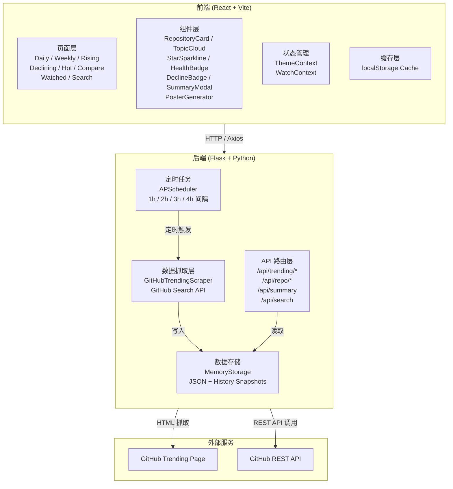

<p align="center">
  
</p>

<h1 align="center">TrendPulse</h1>

<p align="center">
  <strong>GitHub 开源趋势洞察平台 · V0.1</strong>
</p>

<p align="center">
  
  
  
  
  
  
  
</p>

<p align="center">
  <a href="#-项目简介">项目简介</a> ·
  <a href="#-功能特性">功能特性</a> ·
  <a href="#-项目架构">项目架构</a> ·
  <a href="#-快速开始">快速开始</a> ·
  <a href="#-api-文档">API 文档</a> ·
  <a href="#-项目结构">项目结构</a> ·
  <a href="#-贡献指南">贡献指南</a>
</p>

---

## 📖 项目简介

**TrendPulse** 是一个全栈 Web 应用，实时追踪和分析 GitHub 上的热门开源项目。它从 GitHub Trending 页面和 GitHub Search API 抓取数据，提供多维度仓库排行、健康度评估、趋势总结、数据导出等能力。

采用 **玻璃态（Glass Morphism）** 设计风格，支持亮色/暗色主题切换，交互流畅。

---

## ✨ 功能特性

### 🔥 趋势榜单

| 功能 | 描述 |
|------|------|
| **每日热点** | 当日最热门的 50 个开源仓库，每小时更新 |
| **每周热点** | 本周内最受关注的仓库排行 |
| **上升趋势** | 最近 30 天内快速增长的新兴项目（⭐ ≥ 500，30 天内创建） |
| **下降趋势** | 6 个月未推送的热门仓库，含归档/停更/迁移原因分析 |
| **跨榜热度** | 融合日榜、周榜、上升榜的跨周期热门仓库 |
| **仓库搜索** | 基于 GitHub Search API 的全局仓库搜索 |

### 📊 智能分析

| 功能 | 描述 |
|------|------|
| **AI 趋势总结** | 一键生成榜单分析报告，支持三种风格：「📰 日报」「🐶 吐槽」「⚡ 极简」 |
| **健康度评分** | 综合活跃度、成熟度、维护度、发布频率的 0–100 评分 |
| **话题热力地图** | 可视化当前榜单热门标签分布与频次，支持点击筛选 |
| **话题联动分析** | 自动发现话题共现关系（如 `ai` + `llm` 的联动趋势） |
| **跨榜追踪** | 识别同时出现在多个榜单中的仓库 |
| **暗流涌动** | 挖掘排名靠后但 Star 增速惊人的潜力项目 |

### 🛠 实用工具

| 功能 | 描述 |
|------|------|
| **仓库对比** | 并排对比两个仓库的 Stars、Forks、Issues、创建时间等关键指标 |
| **我的雷达** | 关注感兴趣的仓库，自动检测 ±20% 的 Star 剧烈波动并告警 |
| **仓库详情** | 真实 Star 历史、Release 记录、README 内容、最近推送时间 |
| **随机发现** | 一键随机抽取仓库，快速发现冷门好项目 |
| **海报生成** | 基于 Canvas 生成个性化榜单海报（PNG 下载） |
| **数据导出** | 支持 Markdown / CSV / JSON / 独立 HTML 四种格式导出 |
| **本地缓存** | localStorage 智能缓存，节省 API 配额，避免重复请求 |

---

## 🏗 项目架构



---

## 🛠 技术栈

### 前端

| 技术 | 版本 | 用途 |
|------|------|------|
| React | 19.x | UI 框架 |
| Vite | 8.x | 构建工具 |
| Ant Design | 6.x | UI 组件库 |
| React Router | 7.x | 路由管理 |
| Chart.js + react-chartjs-2 | 4.x / 5.x | 数据可视化 |
| Axios | 1.x | HTTP 请求（含自动重试） |

### 后端

| 技术 | 版本 | 用途 |
|------|------|------|
| Python | 3.7+ | 运行环境 |
| Flask | 3.x | Web 框架 |
| Flask-CORS | - | 跨域支持 |
| BeautifulSoup4 | - | HTML 解析（Trending 页面） |
| APScheduler | - | 定时任务调度 |
| Requests | - | HTTP 请求 |
| python-dateutil | - | 日期计算 |

---

## 🚀 快速开始

### 环境要求

- **Python** 3.7+
- **Node.js** 16+
- **npm**

### 方式一：一键启动（推荐）

```bash
# Windows 用户双击运行
start.bat
```

脚本自动完成：
1. 检查端口 5000 / 5173 是否可用
2. 安装缺失依赖
3. 启动后端和前端服务
4. 自动打开浏览器

### 方式二：手动启动

**1. 启动后端**

```bash
cd backend
pip install -r requirements.txt
python app.py
```

后端运行在 `http://localhost:5000`

**2. 启动前端**

```bash
cd frontend
npm install
npm run dev
```

前端运行在 `http://localhost:5173`

### 生产构建

```bash
cd frontend
npm run build
```

构建产物输出到 `frontend/dist/`。

---

## 📡 API 文档

### 服务信息

| 端点 | 方法 | 描述 |
|------|------|------|
| `/api/version` | GET | 获取应用名称与版本号 |

### 趋势数据

| 端点 | 方法 | 描述 |
|------|------|------|
| `/api/trending/daily` | GET | 每日热点（Top 50） |
| `/api/trending/weekly` | GET | 每周热点（Top 50） |
| `/api/trending/rising` | GET | 上升趋势（Top 50） |
| `/api/trending/declining` | GET | 下降趋势（Top 50） |
| `/api/trending/hottest` | GET | 跨榜热度（去重合并日/周/上升榜） |

### 仓库详情

| 端点 | 方法 | 参数 | 描述 |
|------|------|------|------|
| `/api/repo/detail` | GET | `repo` (owner/repo) | 仓库基本信息（含 pushed_at、archived） |
| `/api/repo/star-history` | GET | `stars`, `period`, `days` | Star 模拟历史数据 |
| `/api/repo/history` | GET | `repo`, `days` | 真实 Star 历史快照 |
| `/api/repo/insights` | GET | `repo` | 仓库洞察（下降原因 + README 迁移检测） |
| `/api/repo/releases` | GET | `repo` | 最近 5 个 Release |
| `/api/repo/readme` | GET | `repo` | README 内容（前 8000 字符） |
| `/api/repos/health` | POST | `{ "repos": [...] }` | 批量仓库健康度评分（带 1 小时缓存） |

### 搜索与对比

| 端点 | 方法 | 参数 | 描述 |
|------|------|------|------|
| `/api/search` | GET | `q` | GitHub 仓库搜索 |
| `/api/compare` | GET | `repo1`, `repo2` | 两仓库对比 |

### 智能总结

| 端点 | 方法 | 参数 | 描述 |
|------|------|------|------|
| `/api/summary` | GET | `period`, `tone` | 生成榜单趋势分析报告 |

`tone` 可选值：
- `daily` — 📰 日报模式（完整分析：TOP 5、话题、排名变化、跨榜、暗流）
- `roast` — 🐶 吐槽模式（幽默风格总结）
- `minimal` — ⚡ 极简模式（仅 TOP 3 速览）

### 健康度评分维度

```
综合评分 = 活跃度 × 30% + 成熟度 × 20% + 维护度 × 20% + 发布频率 × 30%

等级划分:
  ≥ 80  → excellent (优秀)
  ≥ 60  → healthy   (健康)
  ≥ 40  → fair      (一般)
  < 40  → at_risk   (风险)
```

**活跃度**：基于 `pushed_at`（最近推送时间），7 天内得满分  
**成熟度**：基于 `stargazers_count`，5 万星以上得满分  
**维护度**：基于 `open_issues / (stars + forks)` 比值  
**发布频率**：基于最近 Release 的发布时间和频率（需 GITHUB_TOKEN）

---

## 📁 项目结构

```
TrendPulse/
├── start.bat                       # 一键启动脚本
├── README.md                       # 项目文档
│
├── backend/                        # Python 后端
│   ├── app.py                      # Flask 主应用 & 所有 API 路由
│   ├── models.py                   # 内存存储 + JSON 持久化 + 线程安全锁
│   ├── scraper.py                  # GitHub Trending 爬虫 & Search API
│   ├── tasks.py                    # APScheduler 定时任务
│   ├── requirements.txt            # Python 依赖
│   ├── github_trending_data.json   # 持久化数据文件
│   └── history/                    # 历史快照目录
│       ├── daily_*.json
│       ├── weekly_*.json
│       ├── rising_*.json
│       └── declining_*.json
│
└── frontend/                       # React 前端
    ├── index.html                  # HTML 入口
    ├── package.json                # 依赖配置 (V0.1.0)
    ├── vite.config.js              # Vite 配置（含 API 代理）
    ├── eslint.config.js            # ESLint 配置
    └── src/
        ├── main.jsx                # React 入口
        ├── App.jsx                 # 根组件（路由 & 主题）
        ├── App.css                 # 全局布局样式
        ├── index.css               # CSS 变量 & 全局样式
        │
        ├── api/
        │   └── api.js              # Axios 封装（含自动重试 & 超时）
        │
        ├── components/
        │   ├── Layout.jsx          # 页面布局容器
        │   ├── Header.jsx          # 顶部导航（搜索 + 通知 + 菜单）
        │   ├── HamburgerMenu.jsx   # 汉堡菜单按钮
        │   ├── PopupMenu.jsx       # 弹出菜单（导航 + 导出）
        │   ├── RepositoryCard.jsx  # 仓库卡片
        │   ├── RepositoryList.jsx  # 仓库列表（筛选 + 海报/总结入口）
        │   ├── FilterBar.jsx       # 语言/话题筛选栏
        │   ├── TopicCloud.jsx      # 话题热力地图
        │   ├── StarSparkline.jsx   # Star 迷你趋势图
        │   ├── HealthBadge.jsx     # 健康度评分徽章
        │   ├── DeclineBadge.jsx    # 下降原因标签（归档/停更/迁移）
        │   ├── RepoDetailModal.jsx # 仓库详情弹窗
        │   ├── RandomDiscover.jsx  # 随机发现
        │   ├── PosterGenerator.jsx # 海报生成器（Canvas）
        │   └── SummaryModal.jsx    # AI 趋势总结弹窗
        │
        ├── pages/
        │   ├── DailyPage.jsx       # 每日热点
        │   ├── WeeklyPage.jsx      # 每周热点
        │   ├── RisingPage.jsx      # 上升趋势
        │   ├── DecliningPage.jsx   # 下降趋势
        │   ├── HotPage.jsx         # 跨榜热度
        │   ├── ComparePage.jsx     # 仓库对比
        │   ├── WatchedPage.jsx     # 我的雷达
        │   └── SearchPage.jsx      # 搜索结果
        │
        ├── contexts/
        │   ├── ThemeContext.jsx    # 主题上下文（亮色 / 暗色）
        │   └── WatchContext.jsx    # 关注列表 + 波动告警
        │
        └── utils/
            ├── cache.js            # localStorage 缓存工具
            └── export.js           # 数据导出（MD / CSV / JSON / HTML）
```

---

## 🎨 设计风格

**玻璃态（Glass Morphism）** 设计语言：

- **半透明卡片** — `backdrop-filter: blur()` + `saturate()` 毛玻璃效果
- **渐变点缀** — 蓝-紫-粉渐变用于顶部装饰条、按钮、海报
- **微交互** — 卡片悬浮上移、按钮缩放、渐变条渐显
- **CSS 变量体系** — 统一管理颜色、阴影、圆角、过渡时间
- **入场动画** — `fadeInUp` 关键帧，卡片依次淡入上移
- **暗色模式** — 完整亮色/暗色主题切换

---

## ⚙️ 配置说明

### GitHub Token（可选）

设置环境变量 `GITHUB_TOKEN` 提升 API 调用限额：

| 模式 | 限额 |
|------|------|
| 未认证 | 60 次/小时 |
| 已认证 | 5,000 次/小时 |

```bash
# Windows PowerShell
$env:GITHUB_TOKEN = "ghp_xxxxxxxxxxxx"

# Linux / macOS
export GITHUB_TOKEN="ghp_xxxxxxxxxxxx"
```

拥有 Token 时还将解锁 **Release 发布频率分析** 功能。

### 定时任务频率

| 数据类型 | 更新间隔 | 最低数据量要求 |
|----------|----------|----------------|
| 每日热点 | 每 1 小时 | ≥ 30 个仓库 |
| 上升趋势 | 每 2 小时 | ≥ 30 个仓库 |
| 每周热点 | 每 3 小时 | ≥ 30 个仓库 |
| 下降趋势 | 每 4 小时 | ≥ 30 个仓库 |

每次更新前自动保存历史快照，支持周/月环比分析。

### 前端代理

`vite.config.js` 已配置开发代理：

```javascript
server: {
  proxy: {
    '/api': {
      target: 'http://localhost:5000',
      changeOrigin: true,
    },
  },
}
```

---

## 🤝 贡献指南

### 开发流程

1. **Fork** 本仓库
2. 创建特性分支：`git checkout -b feature/amazing-feature`
3. 提交更改：`git commit -m 'feat: add amazing feature'`
4. 推送分支：`git push origin feature/amazing-feature`
5. 提交 **Pull Request**

### Commit 规范

本项目推荐 [Conventional Commits](https://www.conventionalcommits.org/)：

| 类型 | 说明 |
|------|------|
| `feat:` | 新功能 |
| `fix:` | Bug 修复 |
| `style:` | 样式调整 |
| `refactor:` | 代码重构 |
| `docs:` | 文档更新 |
| `perf:` | 性能优化 |
| `test:` | 测试相关 |
| `chore:` | 构建/工具链 |

---

## 📄 许可证

MIT License

---

<p align="center">
  <sub>Made with ❤️ · TrendPulse V0.1</sub>
</p>